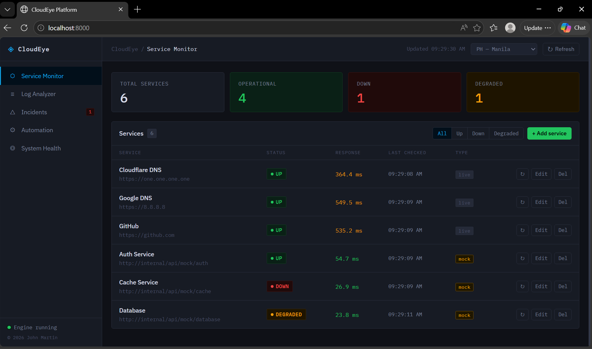
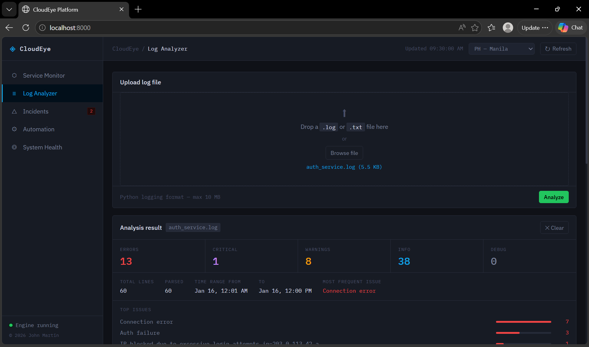
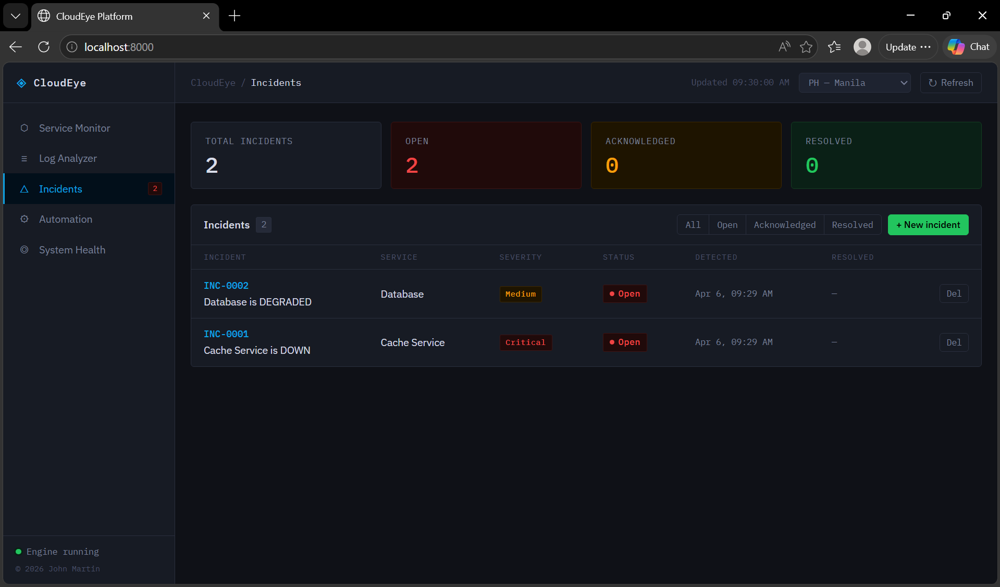
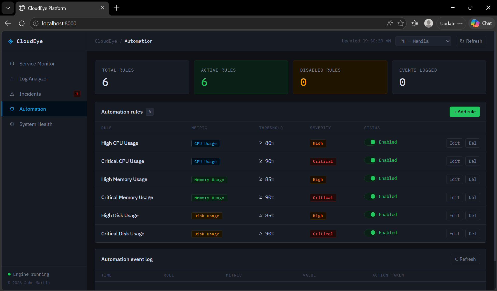
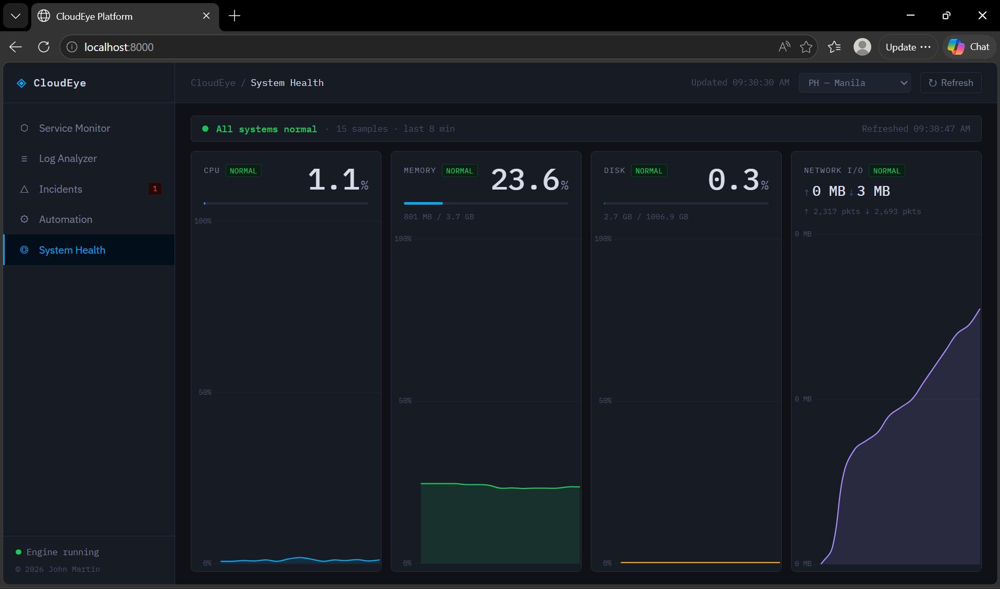

# 👁️ CloudEye — Cloud Operations Monitoring Platform

A full-stack cloud operations platform that monitors services, analyzes logs, tracks incidents, displays system health metrics, and automates responses to infrastructure events.

Built as a portfolio project demonstrating real-world DevOps and cloud engineering concepts.

---

## ✨ Features

### 🔍 Service Monitor
- Real-time HTTP health checks against live endpoints
- Mock service simulation with realistic random failure patterns
- Auto-refresh every 30 seconds with manual trigger
- Check history with visual timeline per service
- Filter by status: All / Up / Down / Degraded

### 📋 Log Analyzer
- Upload and parse Python logging format log files (up to 10 MB)
- Automatic classification of errors into 10 known patterns
- Summary stats: ERROR, CRITICAL, WARNING, INFO, DEBUG counts
- Top issues ranked by frequency with bar chart visualization
- Upload history with ability to re-open past analyses

### 🚨 Incident Tracker
- Auto-creates incidents when services go DOWN or DEGRADED
- Auto-resolves incidents when services recover
- Full `Open → Acknowledged → Resolved` workflow
- Severity levels: Low / Medium / High / Critical
- Per-incident timeline showing every state change
- Manual incident creation for engineer-detected issues
- Open incident count badge on sidebar nav

### 💻 System Health Dashboard
- Live CPU, memory, disk, and network I/O metrics via `psutil`
- Color-coded health tiles: Normal / Moderate / High / Critical
- Trend sparkline charts per metric (last 30 minutes)
- Auto-refreshes every 30 seconds when tab is active
- Overall system status indicator

### ⚙️ Automation Rules Engine
- Define threshold-based rules (e.g. CPU ≥ 90% → create incident)
- Supports CPU, memory, and disk metrics
- Per-rule severity, enable/disable toggle
- 5-minute cooldown prevents duplicate incident flooding
- Automation event log showing every rule trigger

---

## 📸 Screenshots

(assets/screenshots/1_service_monitor.png)
(assets/screenshots/2_service_monitor.png)
(assets/screenshots/3_service_monitor.png)


(assets/screenshots/5_log_analyzer.png)







---

## 🏗️ Architecture

```
Browser (HTML / CSS / JS)
        ↓
FastAPI Backend (main.py)
        ↓
┌───────────────────────────────┐
│  monitor.py   — service polls │
│  metrics.py   — psutil data   │
│  log_parser.py — log analysis │
│  automation.py — rules engine │
└───────────────────────────────┘
        ↓
SQLite Database (cloudeye.db)
```

---

## 🛠️ Tech Stack

| Layer | Technology |
|---|---|
| Backend | Python 3.12, FastAPI |
| Scheduler | APScheduler |
| Metrics | psutil |
| Database | SQLite |
| Frontend | HTML, CSS, JavaScript (Vanilla) |
| Charts | Chart.js |
| Fonts | IBM Plex Sans + IBM Plex Mono |
| Container | Docker + Docker Compose |

---

## 🚀 Getting Started

### 🐳 Docker (Recommended)
 
```bash
# Build and start
docker compose up -d --build
 
# View logs
docker compose logs -f
 
# Stop
docker compose down
```

Open **http://localhost:8000** in your browser.
 
> **Note:** The logs will show `Uvicorn running on http://0.0.0.0:8000` — this is normal. Always use `http://localhost:8000` to access the app.  
> Your data persists across restarts via a Docker volume (`cloudeye_data`). Use `docker compose down -v` only when you want a completely fresh start.

### 🐍 Local Development

```bash
# Clone the repository
git clone https://github.com/yourusername/cloudeye.git
cd cloudeye

# Create and activate virtual environment
python -m venv venv

# Windows
venv\Scripts\activate
# Mac/Linux
source venv/bin/activate

# Install dependencies
pip install -r requirements.txt

# Run the application
uvicorn main:app --reload
```

Open **http://localhost:8000** in your browser.

---

## 📁 Project Structure

```
cloudeye/
├── main.py              # FastAPI app, all API endpoints
├── database.py          # SQLite setup and table creation
├── monitor.py           # Service polling engine + failure simulation
├── metrics.py           # System metrics collection (psutil)
├── log_parser.py        # Log file parser
├── automation.py        # Automation rules engine
├── requirements.txt     # Python dependencies
├── Dockerfile           # Container definition
├── docker-compose.yml   # Multi-container orchestration
└── static/
    ├── index.html       # Main dashboard
    ├── style.css        # Utilitarian/industrial design system
    └── app.js           # Frontend logic
```

---

## 📡 API Reference

The full interactive API documentation is available at `http://localhost:8000/docs` when the server is running (FastAPI auto-generated Swagger UI).

### Key Endpoints

| Method | Endpoint | Description |
|---|---|---|
| GET | `/api/services` | List all services with current status |
| POST | `/api/services` | Add a new service |
| POST | `/api/check-all` | Trigger immediate check of all services |
| POST | `/api/logs/analyze` | Upload and analyze a log file |
| GET | `/api/incidents` | List incidents |
| PATCH | `/api/incidents/{id}` | Update incident status |
| GET | `/api/health/current` | Latest system metrics snapshot |
| GET | `/api/health/history` | Historical metrics for trend charts |
| GET | `/api/automation/rules` | List automation rules |
| POST | `/api/automation/rules` | Create a new rule |
| GET | `/api/automation/events` | Automation event log |

---

## 📅 Development Phases

| Phase | Feature | Status |
|---|---|---|
| 1 | Service Monitor | ✅ Complete |
| 2 | Log Analyzer | ✅ Complete |
| 3 | Incident Tracker | ✅ Complete |
| 4 | System Health Dashboard | ✅ Complete |
| 5 | Automation + Docker | ✅ Complete |

---

## 📄 License

This project is licensed under the [MIT License](LICENSE).
